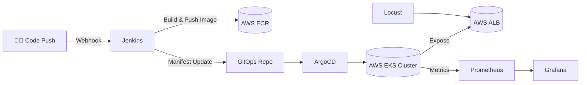
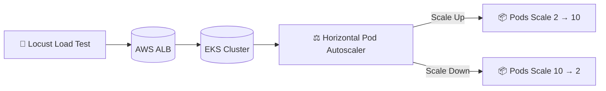

# ⚡ FlashScale – E-Commerce at Big Billion Day Sale

> An end-to-end **E-Commerce at Scale** project that simulates **Big Billion Day / Prime Day** traffic.  
Built with **FastAPI + React(Vite) + AWS EKS + Jenkins + ArgoCD + Terraform + Prometheus + Grafana + Locust** to showcase **CI/CD, GitOps, Auto-Scaling, Monitoring, and Blue/Green Deployments**.

---

## 📖 Overview

FlashScale demonstrates how a modern cloud-native e-commerce system behaves under **flash-sale scale traffic (5000+ concurrent users)**.  

The project validates:
- **Blue/Green Deployments** with live version verification.  
- **CI/CD Pipelines** using Jenkins + Terraform + ECR + EKS.  
- **GitOps with ArgoCD** for continuous delivery.  
- **Horizontal Pod Autoscaler (HPA)** to auto-scale pods (2 → 10).  
- **Monitoring & Observability** with Prometheus + Grafana.  
- **Load Testing** using Locust to simulate peak flash-sale traffic.  
- **Real Debugging & Fixes** that reflect true DevOps experience.  

---

## 🛠️ Tech Stack

| Category                     | Tools / Technologies                          |
|------------------------------|-----------------------------------------------|
| 🌩 **Cloud & Infra**         | AWS EKS · ALB · VPC · IAM · Terraform         |
| 📦 **Containers & Orchestration** | Docker · Kubernetes · HPA                    |
| ⚙️ **CI/CD**                 | Jenkins Pipelines · AWS ECR · ArgoCD (GitOps) |
| 📊 **Monitoring & Observability** | Prometheus · Node Exporter · Kube-State-Metrics · Grafana |
| 🐝 **Load Testing**          | Locust (5000 concurrent users)                |
| 💻 **Application**           | **Backend**: FastAPI (Python) <br> **Frontend**: React(Vite) + Tailwind |
 

---

## 🏗️ Architecture


## 🔑 Key Features
```
🔹 Blue/Green Deployments → Seamless traffic switching between blue & green pods.

🔹 Dynamic Build Metadata → App version, deployment color, build time injected via Jenkins and visible at /api/build-info.

🔹 Ingress + ALB → Routes traffic to backend and frontend.

🔹 Auto-Scaling → HPA scaled backend pods from 2 → 10 under 5000-user load.

🔹 Monitoring → Grafana dashboards for CPU, memory, replicas, custom metrics.

🔹 Load Testing → Locust ramp-up plan for realistic flash-sale traffic simulation.
```
## 🚦 Project Phases
---

### 1️⃣ CI/CD with Jenkins, IaC(Terraform)
- Built & pushed Docker images to **AWS ECR**.  
- Automated deployments with **Jenkins pipeline**.  
---

### 2️⃣ GitOps with ArgoCD
- Synced Kubernetes manifests from GitHub repo.    
- Jenkins pipeline commits updated manifests → ArgoCD auto-syncs.  
---

### 3️⃣ Backend & Frontend Integration
- Backend exposes `/api/build-info` (version, color, build time).  
- Frontend version page dynamically fetches metadata.  
---

### 4️⃣ Monitoring (Prometheus + Grafana)
- Deployed **Prometheus & Grafana** in `monitoring` namespace.  
- Configured scrape jobs: backend, kubelet, node-exporter, kube-state-metrics.   
- Imported dashboards → cluster overview, pods, HPA scaling.  

---

### 5️⃣ Autoscaling (HPA)
- Configured HPA: `min=2`, `max=10`, `targetCPU=60%`.  
- Validated scaling → **2 → 10 pods** under Locust load.  
---

### 6️⃣ Load Testing with Locust
- Custom `locustfile.py` with tasks: `/products`, `/checkout`, `/orders`.  
- Ramp-up plan: **500 → 3000 → 5000 users** → ramp-down.  
- Observed CPU > 60% in Grafana → HPA scaled pods to 10.  

## 🐞 Issues & Fixes

| Issue                          | Root Cause                          | Fix                                                                 |
|--------------------------------|-------------------------------------|---------------------------------------------------------------------|
| Prometheus pods not starting    | Wrong image version                 | Switched to `prom/prometheus:v2.52.0`                               |
| Prometheus targets DOWN         | Wrong service discovery config      | Updated `prometheus.yml` with Kubernetes Service Discovery          |
| Kube-State-Metrics DOWN         | Wrong service port                  | Corrected to `...svc.cluster.local:8080`                            |
| Grafana “No Data”               | Wrong Prometheus datasource URL     | Used correct ClusterIP service                                      |
| Custom metrics missing          | FastAPI not exposing `/metrics`     | Added `prometheus_fastapi_instrumentator`                           |
| Locust port conflict            | Port 8089 already in use            | Killed old process or used `--web-port 8090`                        |
| HPA error: FailedGetResourceMetric | Metrics-server missing             | Installed metrics-server with TLS args                              |
| HPA not scaling green           | No resource requests set            | Added CPU/memory requests & limits                                  |
| HPA scaling capped              | Wrong HPA spec                      | Adjusted `min=2`, `max=10`, `targetCPU=60`                          |
| AWS EKS DNS errors              | Network / kubeconfig issue          | Refreshed with `aws eks update-kubeconfig`                          |


---

## 📂 Useful Commands

### 🔹 Terraform
```
terraform init
terraform plan
terraform apply 
terraform destroy 
```
## 🔧 Kubernetes Debugging & Patching Commands

### 🔹 Debugging Pods & Deployments
```bash
# Get pods with details
kubectl get pods -n flashscale -o wide

# Describe pod (events, scheduling, errors)
kubectl describe pod <pod-name> -n flashscale

# View pod logs
kubectl logs <pod-name> -n flashscale

# Stream logs
kubectl logs -f <pod-name> -n flashscale

# Execute shell inside pod
kubectl exec -it <pod-name> -n flashscale -- /bin/sh

# Restart a deployment
kubectl rollout restart deployment <deployment-name> -n flashscale

# Check rollout status
kubectl rollout status deployment <deployment-name> -n flashscale

# Scale a deployment manually
kubectl scale deployment <deployment-name> --replicas=5 -n flashscale
```
### 🔹 Debugging HPA & Metrics
```bash
# Check HPA details
kubectl get hpa -n flashscale

# Watch HPA scaling in real-time
kubectl get hpa -n flashscale -w

# Top pods (CPU/Memory usage)
kubectl top pods -n flashscale

# Top nodes
kubectl top nodes

# Describe HPA for events
kubectl describe hpa <hpa-name> -n flashscale
```
### 🔹 Debugging Services & Ingress
```bash
# List services
kubectl get svc -n flashscale

# Describe a service
kubectl describe svc <service-name> -n flashscale

# Check Ingress
kubectl get ingress -n flashscale
kubectl describe ingress <ingress-name> -n flashscale
```
### 🔹 Patching Services & Deployments
```bash
Copy code
# Patch service to change type to LoadBalancer
kubectl patch svc <service-name> -n flashscale \
  -p '{"spec": {"type": "LoadBalancer"}}'

# Patch deployment image
kubectl set image deployment/<deployment-name> \
  <container-name>=<new-image>:<tag> -n flashscale

# Patch deployment resources
kubectl patch deployment <deployment-name> -n flashscale \
  -p '{"spec": {"template": {"spec": {"containers": [{"name": "<container-name>", "resources": {"limits": {"cpu": "500m", "memory": "512Mi"}}}]}}}}'

# Patch HPA target CPU
kubectl patch hpa <hpa-name> -n flashscale \
  -p '{"spec": {"targetCPUUtilizationPercentage": 75}}'
```
---
### 🔹 Jenkins
```
Build → Push image to ECR

Deploy → Apply manifests to EKS

Update Manifests → Commit changes to GitOps repo for ArgoCD sync
```

### 🔹 Locust
```bash
# Run with Web UI
locust -f locustfile.py --web-port 8090

# Headless test (no UI)
locust -f locustfile.py --headless \
  -u 5000 -r 100 --run-time 30m \
  --host http://<backend-alb-dns>:8000
  ```


## ✅ Outcomes
```
⚡ System successfully handled 5000 concurrent users

⚡ Backend scaled automatically from 2 → 10 pods under stress

⚡ Prometheus, Grafana, and HPA confirmed real-time scaling

⚡ CI/CD + GitOps pipeline automated build → push → deploy → sync
```
## 📊 Dashboards & Results

- 📈 **Grafana HPA Dashboard** → CPU spikes vs replica scaling  
- 📈 **Pod View** → Backend pods increasing from 2 → 10  
- 📈 **Locust Stats** → Requests per second (RPS), latency, failure % under load  
- 📈 **HPA Events Log** → Confirmed `SuccessfulRescale` events
---

## 📸 Project Screenshots
---

### 🛠️ CI/CD & GitOps
**Jenkins CI**  


**Docker Images**  


**ArgoCD Dashboard**  


**ArgoCD Sync**  


---

### 💻 Application Validation
**Backend Health**  


**Backend Version**  


**Frontend Home**  


**Cart Full**


**Orders Page**  


**Checkout Flow**  


**Track Order**  


**Cart Page**  


**Health**


**Version_Blue**


**Version_Green**


---

### 📊 Monitoring & Scaling
**Prometheus Targets**  


**ArgoCD HPA Dashboard**  


**Grafana HPA Scale Up (v1)**  


**HPA Scale Up (v2)**  


**Grafana HPA View (v3)**  


**HPA Scale Down**  


**Grafana K8s View (1)**  


**Grafana K8s View (2)**  


**Grafana K8s View (3)**  


**Grafana K8s View (4)**  


**Grafana CPU & Memory Utilisation**  


**Locust 5000 Users**  


---
### 📊 Terraform Destroy

**Terraform Destroy**  


---

## 🙌 Closing Note

FlashScale wasn’t just about deploying an app — it was a small try to build how **cloud-native systems can scale like Amazon or Flipkart on a flash-sale day**.  
From **CI/CD pipelines → GitOps → Blue/Green deployments → Monitoring → HPA scaling** — this project showcased the end-to-end journey of building resilient, production-grade infrastructure.

> *“A system’s true strength is not in how it runs at normal load, but in how gracefully it scales when pushed to its limits.”* ⚡

---

## 📬 Let’s Connect
- 💼 Portfolio: [vincloudops.tech](https://vincloudops.tech)  
- 📧 Email: **vinay.venvin@gmail.com**  
- 💻 GitHub: [Vin22-03](https://github.com/Vin22-03)  
- 🔗 LinkedIn: [Vinay V Bhajantri](https://www.linkedin.com/in/vinayvbhajantri)  

---

✨ Thanks for reading about FlashScale! If you found this project interesting, let’s connect and build something even bigger together 🚀

